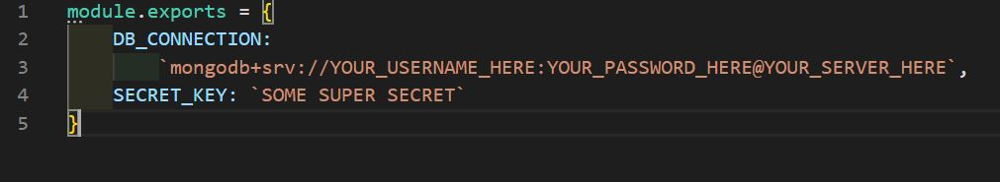

# Express GraphQL Server 

This repository is Express JS GraphQL Server with Users & Posts.

| Dependancies | DevDependancies|
| :-------: |:------:| 
| apollo-server-express | nodemon |
| bluebird ||
| bcryptjs ||
| express || 
| express-graphql || 
| graphql || 
| mongoose || 

Repository READMES: 
*  [GraphQL README](https://github.com/benjaminchacko/express-graphql-server/blob/master/graphql/README.md)
*  [Models README](https://github.com/benjaminchacko/express-graphql-server/blob/master/models/README.md)

## How to Use
1. Fork this repository
2. Clone to your local machine
3. Create a config.js in root directory like this example: 

4. `npm install` in your terminal to install node-modules
5. `npm start` to open development in your browser
